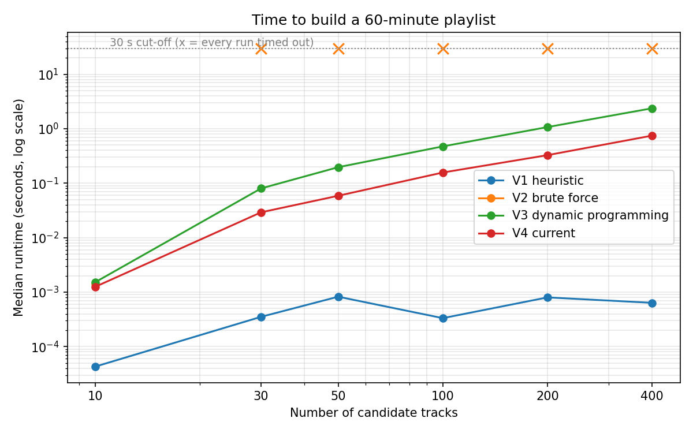

# Spotify Timer Playlist

Build a Spotify playlist that lasts a chosen length of time. Ask for 43 minutes of house, and it creates a private playlist in your account that runs for 43 minutes.

Picking a set of songs whose durations add up to a target is the **subset-sum problem**, so most of this project is about solving that quickly and exactly. The current solver handles 400 candidate tracks and a two-hour target in under a second.

> **Demo:** _add a GIF of a run here, plus a screenshot of the resulting playlist._

## How it works

1. `clean_data.py` removes duplicate tracks from the Kaggle dataset.
2. `playlist_generator.py` asks for a length and a genre, then keeps tracks in that genre that are 90 seconds to 10 minutes long with a popularity above 40.
3. `solver.py` picks a subset of those tracks whose durations add up to the target.
4. `spotify_client.py` creates a private playlist in your account and fills it.

### The algorithm

Subset-sum is NP-complete, so there is no known method that is fast for every input. Checking all combinations means up to 2ⁿ of them: with 30 tracks that is already over a billion.

The solver avoids this by working with totals rather than combinations. It keeps a dictionary mapping each reachable total, in whole seconds, to one set of tracks that reaches it:

```
{0: [], 214: ["t1"], 389: ["t2"], 603: ["t1", "t2"], ...}
```

Two different combinations that reach the same total are interchangeable for this purpose, so only the first is kept. That caps the dictionary at the number of seconds up to the target plus 10%, however many tracks there are. The work is then roughly (number of tracks) × (target in seconds), which grows in proportion to its inputs rather than exponentially. Because the running time depends on the size of the numbers rather than only on how many there are, this is a pseudo-polynomial algorithm.

Two details:

- Each pass takes a snapshot of the dictionary before adding the current track, so no track can be used twice within a playlist.
- The candidate tracks are shuffled first, so the same request gives a different valid playlist each time.

## Benchmark

`benchmark.py` compares four versions of the algorithm, written in the order I built them:

| Version | Approach |
|---|---|
| V1 | Heuristic: overfill the playlist, then swap tracks until it is within 100 ms |
| V2 | Brute force: store every combination and its total |
| V3 | Dynamic programming: one combination per reachable total |
| V4 | V3, with the snapshot fix and shuffling (current) |

600 runs: 4 algorithms × 6 track counts (10–400) × 5 targets (5–120 minutes) × 5 repeats, with a 5-second cut-off per run.



Median runtime for a 60-minute target, in seconds:

| Tracks | V1 | V2 | V3 | V4 |
|---|---|---|---|---|
| 10 | 0.000 | 0.001 | 0.002 | 0.001 |
| 30 | 0.000 | timed out | 0.080 | 0.029 |
| 50 | 0.001 | timed out | 0.197 | 0.059 |
| 100 | 0.000 | timed out | 0.474 | 0.157 |
| 200 | 0.001 | timed out | 1.071 | 0.327 |
| 400 | 0.001 | timed out | 2.371 | 0.747 |

Runs that produced no answer within 5 seconds, across the whole grid:

| Version | Failed |
|---|---|
| V1 | 26% |
| V2 | 64% |
| V3 | 2.7% |
| V4 | 0% |

What the results show:

- **Brute force dies early.** V2 finished every 10-track test and almost nothing beyond that: with a 60-minute target it failed at every size from 30 tracks up. Its work grows with the number of combinations, not the number of tracks.
- **The heuristic is fast but unreliable.** When it converges it is the quickest of all, by a wide margin, and it hits the target exactly. But it failed a quarter of the grid, and its failures cluster on *short* targets with plenty of tracks: a 5-minute playlist holds only two or three songs, so there is almost nothing to swap, and it oscillates until the cut-off.
- **Removing the redundant work is worth about 3×.** V4 is 2.4–3.1× faster than V3 between 30 and 200 tracks. At 400 tracks the measured ratio drops, but only because V3's slowest runs timed out and so were excluded.
- **V3 is also less accurate when tracks are scarce.** In every case where the two disagreed, V4 was closer to the target, once by 4 minutes. V3 reads its dictionary while modifying it, so a total that is overwritten mid-pass loses the routes that led onwards from it. That only matters when few combinations exist, which is why the bug stayed hidden in ordinary use.

Raw results: `docs/benchmark_results.csv`.

## Setup

**Requirements:** Python 3.10+, a Spotify account, and a Spotify developer app.

1. Clone the repo and install the dependencies:

   ```bash
   git clone https://github.com/PierreNedellec/Spotify-timer-playlist.git
   cd Spotify-timer-playlist
   python -m venv .venv
   .venv\Scripts\activate        # Windows
   source .venv/bin/activate     # macOS / Linux
   pip install -r requirements.txt
   ```

2. Create an app at [developer.spotify.com/dashboard](https://developer.spotify.com/dashboard) and add `http://127.0.0.1:8888/callback` as a redirect URI.

3. Copy `.env.example` to `.env` and paste in your client ID and secret.

4. Download the [Kaggle Spotify Tracks Dataset](https://www.kaggle.com/datasets/maharshipandya/-spotify-tracks-dataset), save it as `data/spotify-tracks_source_data.csv`, and clean it:

   ```bash
   python clean_data.py
   ```

5. Run it:

   ```bash
   python playlist_generator.py
   ```

   The first run opens a browser window to authorise the app.

## Tests

```bash
python -m pytest
```

The tests cover the solver alone: an exactly reachable target, an unreachable one, no repeated tracks, and time formatting.

## Project structure

```
clean_data.py           # de-duplicates the Kaggle dataset
solver.py               # subset-sum solver (no Spotify, no files)
spotify_client.py       # login, playlist creation
playlist_generator.py   # command-line interface
benchmark.py            # compares the four algorithm versions
tests/test_solver.py
docs/                   # benchmark chart and raw results
```

## Limitations

- Track durations are rounded to whole seconds before being added up, so a playlist reported as 30:00 can be a few seconds out in Spotify.
- The solver accepts totals up to 10% over the target and returns the closest it can reach. If a genre has too few tracks, it says how far off it is.
- Popularity comes from the Kaggle dataset, which is a snapshot rather than live data.

## Roadmap

How I might extend this project in the future:
- Web app, so it works without a Python environment.
- Build playlists from your own saved tracks rather than a fixed dataset.
- Use Spotify's energy score to shape the playlist, for example rising and then winding down. Once hitting the duration is easy, the interesting question becomes which of the many exact playlists is best.

## Data source

[Kaggle Spotify Tracks Dataset](https://www.kaggle.com/datasets/maharshipandya/-spotify-tracks-dataset) by maharshipandya.

## Licence

MIT.